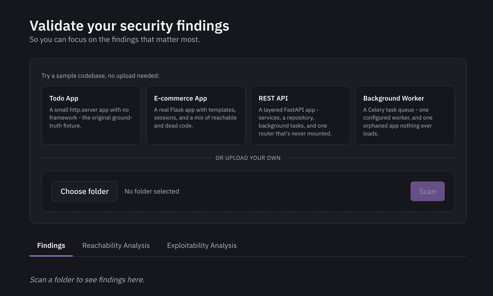
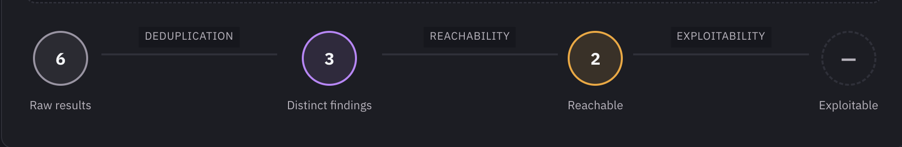
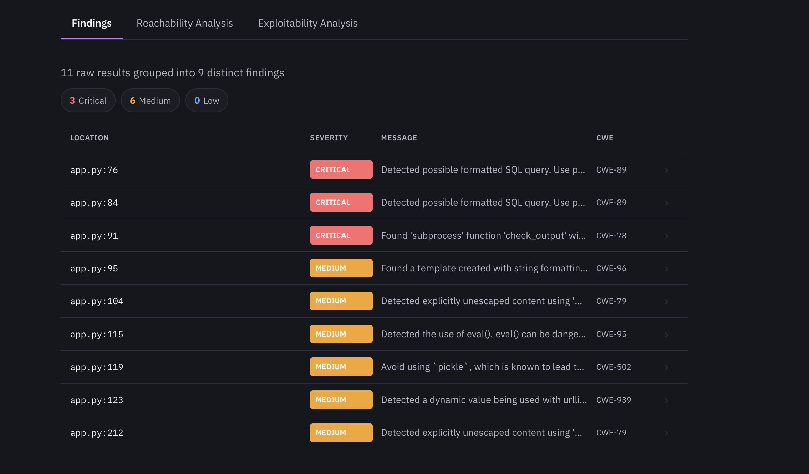
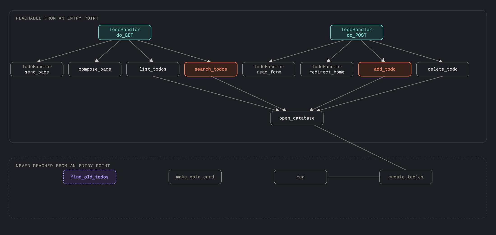
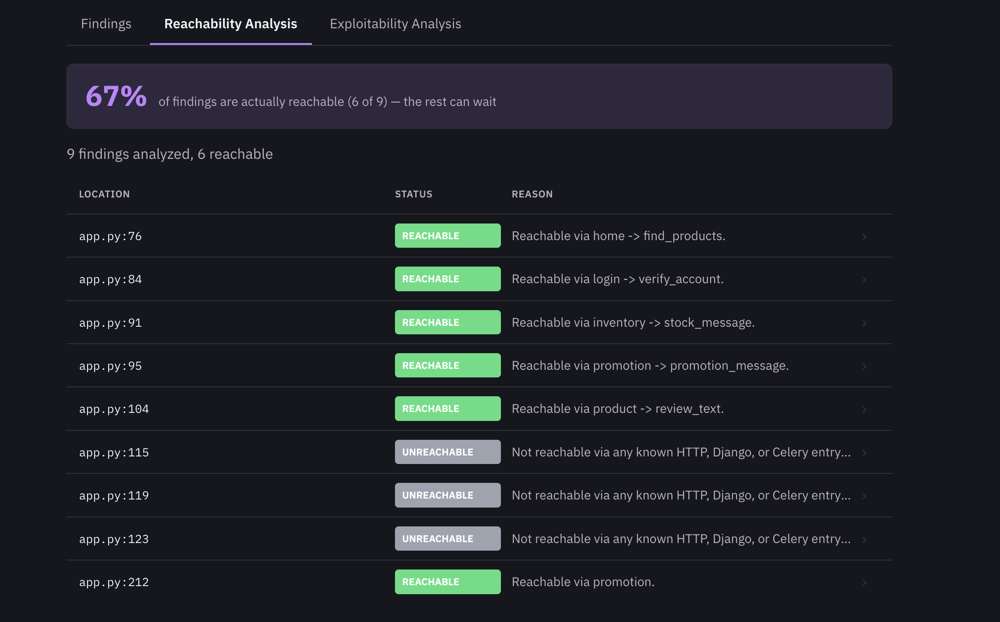

# Validate your security findings

A scanner like Semgrep can turn up hundreds or thousands of findings on a real codebase.
Most of them are duplicates of each other, or point at code nobody can actually reach
from outside the application. This tool takes that raw output and narrows it down to the
findings that are real, reachable, and worth an engineer's time — so instead of
triaging a thousand rows by hand, you're looking at the handful that actually matter.

**Live demo:** [agentic-validation-view.onrender.com](https://agentic-validation-view.onrender.com)
(runs on a free host, so the first load can take a moment to wake up — the bundled
sample apps are the fastest way to see it work, no upload needed)



## How it actually works

Everything below is real and running, in this order, except the last step, which is
still being designed — that's called out explicitly when we get there. Here's the whole
pipeline at a glance before the step-by-step breakdown:



### 1. Get a codebase

Either upload a folder, or pick one of the bundled sample apps (small, deliberately
vulnerable demo projects built specifically to have a known, verified set of reachable
and unreachable bugs — useful for trying the tool without needing your own code).

### 2. Scan it, and collapse duplicate results

The codebase is scanned with [Semgrep](https://semgrep.dev). Scanners routinely report
the same underlying bug more than once — a SQL injection at a given line might get
flagged by two or three different rules simultaneously. Those get grouped into one
finding per unique location, so the count you see is real bugs, not rule hits.



### 3. Build a call graph

For every function in the codebase, the tool records where it's defined and walks its
body for calls to other functions — building a map of "who calls whom" across the whole
project. It also tags which functions are actual entry points: routes a web framework
would dispatch to, Celery tasks a worker would run, anything reachable from outside the
program by convention rather than by a literal function call in the code.

This step is deliberately conservative: a call is only recorded when it's unambiguous
(a plain function name, or `self.method()`, or a few other verified-safe patterns) — an
earlier evaluation of an existing open-source tool found it silently guessing on
ambiguous calls and producing false positives as a result. This project chose precision
over completeness: no edge means no confident claim of a connection, not a guess.



*(That diagram is a hand-built illustration of the concept, not a live feature of the
running app — there's no in-app graph visualization yet.)*

### 4. Trace reachability

For each finding, the tool walks backward from the function it's inside, hop by hop,
checking at every single hop whether that function is a tagged entry point — not just
whether the finding's own function has *a* caller, since a function can have callers
that are themselves never called by anything real. If the walk reaches a real entry
point, the finding is reachable, with the actual call path shown as evidence. If it runs
out of callers first, it's unreachable — capped at medium confidence rather than high,
since only a handful of entry-point categories are checked today (HTTP routes, Django
URLs, Celery tasks) and anything outside those categories genuinely wasn't checked.

Where a call was skipped as ambiguous rather than confidently resolved, and that gap is
the only reason no path was found, the result comes back as **unknown** instead of a
falsely confident **unreachable** — the tool says "can't tell" rather than guessing.



### 5. Judge exploitability — *designed, not yet built*

This is the next piece, not something you can try yet. The plan, split into two tiers
for cost and safety reasons — full detail in
[`docs/phase-4-5-exploitability-notes.md`](docs/phase-4-5-exploitability-notes.md):

- **Static reasoning (ships first):** an agent reads the actual code along a reachable
  finding's call path and judges whether the dangerous input is genuinely
  attacker-controlled and unsanitized by the time it reaches the sink — a written
  judgment with its reasoning shown, not a guarantee. No code execution, safe to run
  against anything.
- **Sandboxed confirmation (stretch goal):** actually running a target app in isolation
  and firing a real exploit at it to confirm, not just judge. Scoped only to this
  project's own controlled test apps — never run against a codebase someone else
  submitted.

## Try it

- **Live:** [agentic-validation-view.onrender.com](https://agentic-validation-view.onrender.com)
  — pick a sample app for the fastest path, or upload your own folder (small, non-sensitive
  code only — this is a demo, not built or audited for production use).

## Run it locally

Two terminals:

```bash
# Backend
cd src
pip install -r ../requirements.txt -r ../requirements-dev.txt  # one-time
uvicorn api:app --reload --port 8000

# Frontend
cd src/frontend
npm install   # one-time
npm run dev
```

Open `http://localhost:5173`. The sample apps work immediately; to try your own code,
choose a folder (`src/sample-apps/todo-list-app` is a good first try) and hit Scan.

## Tech stack

FastAPI + Uvicorn (backend), React + TypeScript + Vite (frontend), Semgrep (scanning),
pytest (testing). Full reasoning behind each choice:
[`docs/project-design.md`](docs/project-design.md).

## Status

- **Contracts, self-scan pipeline, UI:** done — real upload/sample → Semgrep scan →
  findings, end to end.
- **Reachability:** done — call graph, entry-point detection (HTTP, Django, Celery),
  backward tracing, confidence model. 34/34 correct against real ground-truth apps,
  87 tests passing.
- **Exploitability:** designed, not yet built (see step 5 above).
- **Everything past that** (prioritization/reporting, a local-CLI mode so scanning can
  run entirely on your own machine, more languages/scanners, continuous re-validation on
  new commits): planned, not started.

Full phase-by-phase working notes: [`CLAUDE.md`](CLAUDE.md). Design docs: [`docs/`](docs/).
